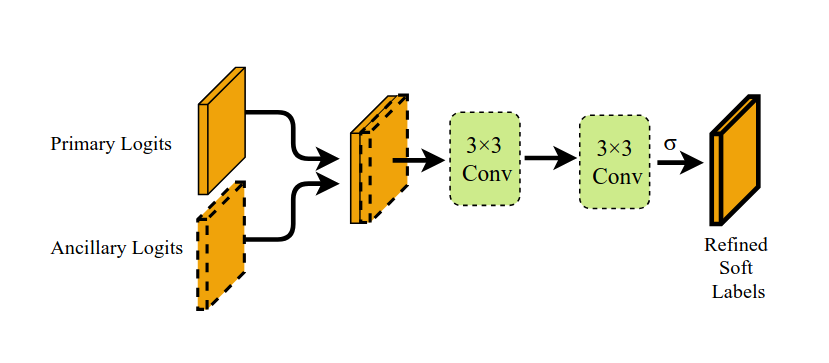

  

<h1 align="center"> Semi-Supervised Semantic Image Segmentation with Self-correcting Networks </h1>

  A pytorch implementation of the <strong>CVPR 2020 paper</strong>, <a href="https://openaccess.thecvf.com/content_CVPR_2020/papers/Ibrahim_Semi-Supervised_Semantic_Image_Segmentation_With_Self-Correcting_Networks_CVPR_2020_paper.pdf"><em>Semi-Supervised Semantic Image Segmentation with Self-correcting Networks</em></a> by <strong>Ibrahim et al.</strong>
  This framework enables joint learning from a small fully supervised dataset and large weakly labeled data, using self-correcting networks to refine predictions and reduce annotation noise 

## Table of Content
1. [Stage 1: Ancillary Model Training](#stage-1-ancillary-model-training)
    - [Ancillary Model Architecture](#ancillary-model-architecture)
    - [Ancillary Model Loss Function](#ancillary-model-loss-function)
    - [Ancillary Model Hyperparameters](#ancillary-model-hyperparameters)
    - [Ancillary Model Training Setup](#ancillary-model-training-setup)
    - [Ancillary Model Training Dataset](#ancillary-model-training-dataset)
    - [Ancillary Model mIoU](#ancillary-model-miou)
2. [Stage 2 Correcting Network Training](#stage-2-correcting-network-training)
    - [Correcting Network Architecture](#correcting-network-architecture)
    - [Correcting Network Loss Function](#correcting-network-loss-function)
    - [Correcting Network Hyperparameters](#correcting-network-hyperparameters)
    - [Correcting Network Training Setup](#correcting-network-training-setup)
    - [Correcting Network Training Dataset](#correcting-network-training-dataset)

<strong>The approach in the paper divides training into three stages: the first trains the ancillary model, the second trains the self-correcting network, and the third focuses on the primary model.</strong>

## Stage 1 Ancillary Model Training

  

Stage 1 trains the ancillary model to learn robust representations from weakly labeled examples.

### Model Architecture
the model is built on standard encoder-decoder segmentation models (DeepLabV3+ is used in my implementation), the paper is extending the architecture with additional bounding box input.

1. Image Encoder:
The input image is processed by a pretrained conv encoder (Resnet101 is used in my implementation). it produces 2 scale feature maps (low and high feature maps).

2. Bounding Box Encoder:
This encoder takes the weak labeled mask to encode box information into spatial attention map.

The input weak mask is resized (using 3x3 Conv followed by sigmoid activation) to match the spatial resolution of low and high feature map.

3. Feature Attention Fusion:
In this step the output of bounding box encoder (box low and high) are fused with the low and high attention map from Image encoder using <strong>Element wise multiplication </strong>.

4. Decoder:
Same as Deeplabv3+ decoder the decoder is expecting multi scale feature maps.
Both fused low and high scales are passed to decoder 
low is passed to internal layer of the decoder and
high is passed to the begining of the decoder.

### Loss Function
The model is learning conditional probability distribution over input image (x) and weak labeled mask (b)

Panc(y | x, b)

The loss function is normal <strong>Cross Entropy</strong>

L = -log Panc(y | x, b)

### Hyperparameters
|Parameter|Value|
|---|---|
|Learning rate| 7e-3 |
|Batch size| 4 each GPU |
|# GPUs| 2 |
|Scheduler|custom: step based scheduler|
|Optimizer| SGD |
|Gradient Accumulation| 1 |
|Stage1 Epochs| 184 |
|weight_decay| 4e-5 |

### Training Setup
The paper authours used <strong>4 GPUs, each with a batch of 4 images</strong>.
I trained the model on Kaggle free tier <strong>2 GPU T4 each with a batch of 4 images.</strong> kaggle doesn't allow continous training more than 12 hours. so I trained multible iterations.

### Training Dataset
Half of the fully supervised training dataset is used in this stage to prevent data leakage in the next stage where the self-correcting network is using the ancillary model outputs.

### Ancillary Model mIoU
I reached ~85.2 mIoU while paper reports ~85.5 the difference may come from multiple reasons
1. My total batch size is 8 when paper uses batch size of 16, which results in different values for BatchNorm layers.
2. The output stride value of backbone (Xception65) due to GPU limitations I used 16 If they used 8 this can make a little bit difference in mIoU.
3. The split of fully supervised dataset: The split can contribute to the mIoU if it is better on matching validation dataset distribution.
4. Something I couldn't figure out :)

## Stage 2 Correcting Network Training

  

Stage 2 mainly trains the correcting network to learn joint representations from ancillary model & primary model logits - the primary model is trained also in this stage.

### Correcting Network Architecture
self-correction network learns refining the input label distributions. The subnetwork receives logits from the primary and ancillary models, then concatenates and feeds the output to the network.

1. No self-correction: this is just a baseline to compare the primary model without any refining

2. Linear self-correction: The primary model and ancillary model outputs project to 1d then feed to FNN.

3. Convolutional self-correcting: The main contribution of the paper, this network is concatinating both the primary and ancillary logits then passed to 2 3X3 conv layers to produce refined soft label.

### Correcting Network Loss Function

The convolutional self-correcting network learns a refined label distribution from the logits of the ancillary model and the primary segmentation model

qconv(y | lprim, lanc; λ)

where

lprim = logits from Pprim(y | x)

lanc = logits from Panc(y | x,b)

The loss function is standard <strong>Cross Entropy</strong>

L = -log qconv(y | l, lanc; λ)

### Correcting Network Hyperparameters
|Parameter|Value|
|---|---|
|Learning rate| 5e-4 |
|Batch size| 4 each GPU |
|# GPUs| 2 |
|Scheduler|custom: step based scheduler|
|Optimizer| SGD |
|Gradient Accumulation| 1 |
|Stage2 Epochs| 8 |
|weight_decay| 4e-5 |

### Correcting Network Training Setup
The network is trained on Kaggle free tier <strong>2 GPU T4 each with a batch of 4 images.</strong>.

### Correcting Network Training Dataset
Fully supervised training dataset is used in this stage. Weak dataset is not used.
